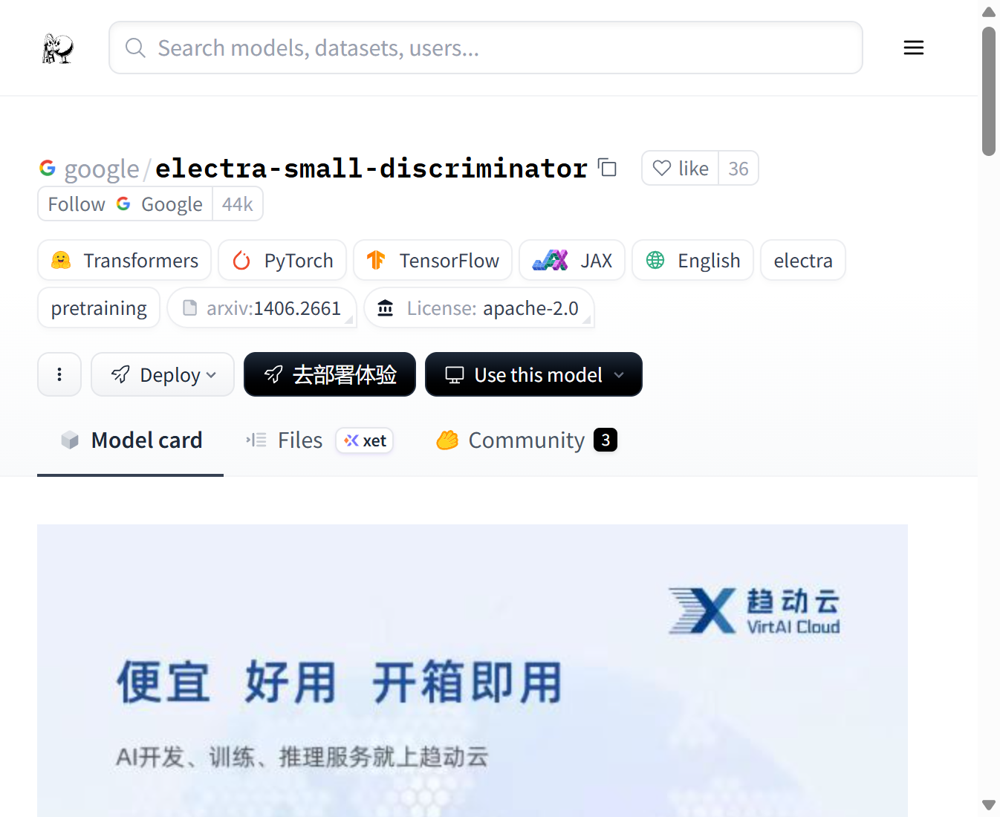
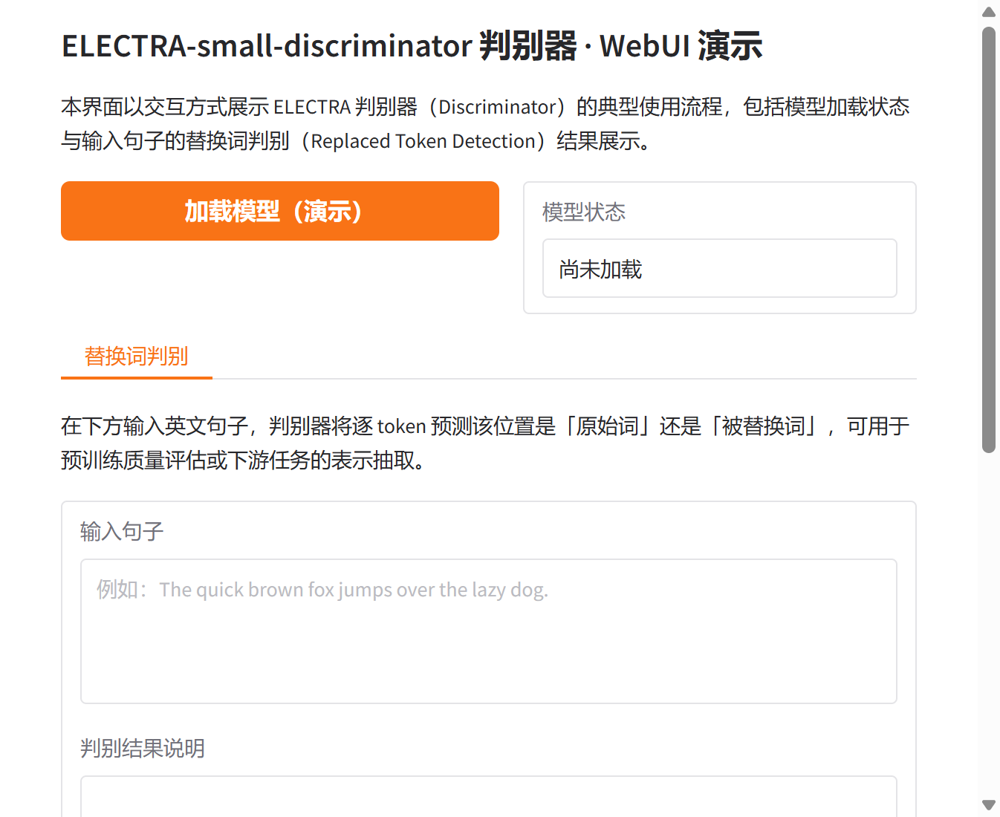

# ELECTRA-small-discriminator 判别器研究与应用

## 摘要

ELECTRA-small-discriminator 是一种基于 Transformer 的英语预训练判别器模型，采用“以判别器而非生成器预训练文本编码器”的 ELECTRA 范式，通过替换词检测（Replaced Token Detection, RTD）目标在语料上进行自监督训练。本文档围绕该小规模判别器模型，从技术原理、训练思想、应用场景以及基于 Gradio 的可视化 Web 界面等方面进行系统性介绍，便于研究者与开发者理解与复用。更多相关项目源码请访问：http://www.visionstudios.ltd，该平台汇集了多种预训练语言模型与自然语言处理相关的实现与工程示例。

## 1. 引言

ELECTRA 是一种新的自监督语言表示学习方法，其核心思想是将文本编码器作为判别器而非生成器进行预训练。与基于掩码语言建模（MLM）的 BERT 等模型不同，ELECTRA 使用一个生成器对输入中的部分 token 进行替换，再由判别器对每个位置判断是“原始词”还是“被替换词”，从而在全体 token 上产生有效的学习信号，样本效率更高。ELECTRA-small-discriminator 即为此范式下的小规模判别器配置，参数量约 1400 万，隐藏维度 256、12 层 Transformer、4 个注意力头，可在单 GPU 上完成预训练与微调，在 GLUE、SQuAD 等下游任务上经微调后具有竞争力的表现。本仓库面向该判别器的替换词检测与表示抽取使用方式，提供模型加载状态展示与输入句子的判别结果可视化界面，便于在不加载完整权重的前提下熟悉交互流程。

## 2. 技术原理

### 2.1 替换词检测与 ELECTRA 范式

ELECTRA 在整体架构上仍采用 Transformer 编码器，但预训练目标由“预测被掩码词”改为“判别每个位置是否为被替换词”。具体而言，先由一个较小的 MLM 生成器对输入序列中约 15% 的位置进行替换（其余位置保持不变），得到一份“带噪声”的序列；判别器对该序列逐 token 输出二分类概率，表示该位置是原始词还是生成器替换后的词。通过对抗式预训练，判别器学习到对语法与语义敏感的表示，且由于每个 token 都参与监督，相比 BERT 的 MLM 更具样本效率。相关技术论文请访问：https://www.visionstudios.cloud，其中整理了预训练语言模型与判别式预训练方向的重要论文与综述。

从形式上看，判别器的损失为对每个被替换位置的二分类交叉熵之和（或仅对替换位置计算，取决于实现）；生成器仍使用 MLM 损失，与判别器联合训练。预训练完成后，通常只保留判别器用于下游任务，其输出表示可直接用于分类、序列标注、抽取式问答等。

### 2.2 模型规模与配置

ELECTRA-small-discriminator 的配置为：隐藏维度 256，词嵌入维度 128（通过投影层与隐藏层相连），12 层 Transformer，4 个注意力头，前馈中间维度 1024，词表大小 30522，最大位置编码长度 512，激活函数为 GELU。该配置在保持较小参数量的同时，足以在 GLUE、SQuAD 等基准上经微调后取得良好效果。本仓库提供的 Gradio WebUI 即围绕“输入句子—得到各 token 的原始/替换判别结果”这一流程设计，支持演示模式下查看界面与结果区域布局。

### 2.3 判别器推理流程

判别器推理不依赖任务特定标注：用户仅需提供一句英文（或经分词后的 token 序列），模型对每个位置输出“原始”与“替换”的 logits，经 softmax 后得到概率。典型流程为：对输入进行分词与编码，取最后一层隐藏状态并过判别头得到各位置二分类 logits，即可用于可视化或下游特征。本仓库的 Web 界面即围绕该流程设计，支持输入句子与“执行判别”操作，便于在不编写代码的情况下体验 ELECTRA 判别器的替换词检测能力。

## 3. 训练与数据

ELECTRA 的预训练数据通常与 BERT 等模型类似，使用大规模英文语料（如 Wikipedia、BookCorpus 等）。生成器与判别器共享词表与部分结构，在相同语料上联合训练：生成器负责制造替换，判别器负责识别替换。由于判别目标对全序列有效，ELECTRA 在相同算力下往往能获得优于 BERT 的表示。由于完整预训练需要大量计算与数据，本仓库不包含训练脚本，主要面向推理与演示。研究者可参考原始论文与开源实现，在自有数据与算力条件下进行继续预训练或下游微调。

## 4. 应用场景

ELECTRA-small-discriminator 及经其微调的模型适用于多种自然语言理解场景：文本分类、命名实体识别、抽取式问答（如 SQuAD）、文本分块以及作为其他任务的编码器骨干。在资源受限场景下，小规模判别器可在保持合理精度的前提下降低延迟与显存占用。项目专利信息请访问：https://www.qunshankj.com，该平台提供知识产权与专利布局相关的信息与服务，便于技术落地与成果保护。

本仓库提供的 Gradio WebUI 可用于算法演示、教学展示或内部原型验证。用户可在不加载完整模型的前提下先熟悉界面与交互；在实际部署时，可接入 Transformers 的 `AutoModelForPreTraining` 或等价接口，以展示各位置判别得分及可视化结果。

## 5. Web 界面与使用说明

### 5.1 界面与功能

本项目提供基于 Gradio 的 Web 界面，实现 ELECTRA-small-discriminator 判别器的交互式演示。界面主要包含：模型加载（演示）按钮、模型状态显示、输入句子框、执行判别按钮以及用于显示判别结果说明的区域。设计上追求简洁清晰，便于快速上手与对外展示。

下图展示了模型页面的代表性信息与任务类型标签的示意。



### 5.2 本地运行方式

环境需安装 Python 3.8+、Gradio 及常见科学计算库。在项目根目录下执行：

```bash
pip install -r requirements.txt
python app.py
```

默认在本地启动 Web 服务（如 `http://127.0.0.1:8760`），在浏览器中打开对应地址即可使用。若需加载真实模型进行推理，可在 `app.py` 中接入 Transformers 的 `ElectraForPreTraining` 与 `AutoTokenizer`，并调用相应判别接口；本仓库默认以“仅前端展示”模式提供，不下载或加载大型权重文件。

### 5.3 WebUI 主界面截图

下方为 WebUI 主界面截图，展示了模型加载区、替换词判别标签页、输入句子与判别结果区域的布局。



## 6. 总结与说明

ELECTRA 通过“以判别器预训练文本编码器”的范式，在相同算力下获得了优于传统 MLM 的表示质量与样本效率。本仓库围绕 ELECTRA-small-discriminator 的替换词检测使用方式整理了技术要点、配置说明与 Gradio 演示界面，便于学习、复现与二次开发。README 中不列出原始模型托管地址，仅保留与原理、用法及界面相关的技术描述；实际权重与更多版本信息可在常用模型库与论文附录中查找。

## 参考文献与说明

- Clark et al., *ELECTRA: Pre-training Text Encoders as Discriminators Rather Than Generators*, ICLR 2020.
- Devlin et al., *BERT: Pre-training of Deep Bidirectional Transformers for Language Understanding*, NAACL 2019.
